# 📡 Real-Time Social Stream Ingestion & Data Quality Pipeline

[]()
[]()
[]()
[]()

> Pipeline d'ingestion automatisée en continu, parsing textuel, fiabilisation et transmission sécurisée de flux d'événements entrants vers des bases de données et feuilles de calcul partagées (APIs REST & Webhooks).

---

## 1. Contexte & Enjeux Métier

Dans les environnements commerciaux à fort volume d'interactions (live streaming, publications sponsorisées, messageries), les entreprises font face à un défi critique de **perte de prospects** et d'**erreurs de saisie manuelle**.

Ce worker d'ingestion a été conçu pour automatiser de bout en bout l'extraction, la standardisation et la fiabilisation des flux entrants, en garantissant un délai d'acheminement inférieur à la minute et une déduplication stricte des informations clients.

---

## 2. Architecture du Flux de Données

```mermaid
flowchart LR
    subgraph Sources ["Flux Entrants (Multi-Canaux)"]
        FB_Posts["Publications & Commentaires"]
        FB_Live["Flux Vidéos Live en Direct"]
        FB_Inbox["Conversations Messagerie"]
    end

    subgraph Worker ["Worker d'Ingestion & Qualité (Python / CI-CD)"]
        Fetch["Graph API Fetcher<br/>(Pagination dynamique & Rate Limit)"]
        Normalize["Normalisation Unicode<br/>(Chiffres arabes/orientaux & Nettoyage)"]
        RegexEngine["Moteur de Regex & Validation<br/>(Identification numéros & formats)"]
        DedupEngine["Contrôle Qualité & Déduplication<br/>(Fenêtre glissante & Ignore List)"]
    end

    subgraph Destinations ["Destinations & Persistance Sécurisée"]
        Webhook["Passerelle API Webhook<br/>(Signature HMAC / Secret partagé)"]
        Spreadsheets["Google Sheets / Excel Partagé<br/>(Google Apps Script API)"]
        SQLDB[("Bases SQL / CRM Client<br/>(Historisation & Traçabilité)")]
    end

    Sources --> Fetch
    Fetch --> Normalize
    Normalize --> RegexEngine
    RegexEngine --> DedupEngine
    DedupEngine -- "Payload Structuré & Validé" --> Webhook
    Webhook --> Spreadsheets
    Webhook --> SQLDB
```



---

## 3. Démarche de Qualité & Gouvernance des Données

Conformément aux exigences de rigueur industrielle :
- **Normalisation Numérique Multilingue :** Conversion automatique des chiffres arabes orientaux (`٠-٩`) en chiffres arabes occidentaux (`0-9`) afin de garantir l'homogénéité des données stockées.
- **Règles de Validation Strictes (Data Quality Rules) :**
  - Validation de longueur exacte (8 chiffres).
  - Contrôle des préfixes d'opérateurs de télécommunication valides (`2, 3, 4, 5, 7, 9`).
  - Filtrage immédiat par liste noire / ignore-list pour écarter les numéros de service ou internes.
- **Fenêtre Glissante de Déduplication (`DEDUP_WINDOW_S`) :**
  - Maintien d'un cache mémoire des identifiants et numéros déjà transmis sur une fenêtre temporelle configurable (ex: 3600 secondes) pour éliminer les doublons causés par les relances utilisateurs.
- **Sécurisation des Échanges :**
  - Authentification par jeton secret d'en-tête (`RECEIVER_SECRET`) garantissant que seul le worker autorisé peut alimenter l'API réceptrice.
  - Zéro secret en dur dans le code source : injection dynamique via GitHub Actions Secrets.

---

## 4. Structure du Projet

```plaintext
facebook-fetcher/
├── .github/
│   └── workflows/
│       └── fetch.yml         # Déclenchement automatique par cron (toutes les X minutes)
├── worker.py                 # Moteur d'ingestion, parsing, normalisation et dispatching
├── requirements.txt          # Dépendances légères (requests)
└── README.md                 # Spécifications et documentation d'architecture
```

---

## 5. Variables d'Environnement

| Variable | Description | Exemple / Valeur par défaut |
|---|---|---|
| `FB_GRAPH_VER` | Version de l'API Graph Meta | `v23.0` |
| `RECEIVER_URL` | URL de destination du Webhook sécurisé | `https://script.google.com/macros/s/.../exec` |
| `RECEIVER_SECRET` | Clé d'authentification partagée | `SecretToken...` |
| `PAGES_JSON` | Liste JSON des identifiants de pages et tokens d'accès | `[{"id":"...","token":"..."}]` |
| `DEDUP_WINDOW_S` | Durée de la fenêtre de déduplication (en secondes) | `3600` |
| `IGNORE_LIST` | Liste des numéros exclus séparés par des virgules | `36011012,12345678` |

---

## 6. Auteur & Contexte

- **Développeur :** Dhia Romdhane — Élève-Ingénieur Data Science & Analytics (ESPRIT)
- **GitHub :** [github.com/dhia10](https://github.com/dhia10)
- **Contexte :** Projet d'automatisation de capture de leads et fiabilisation de flux de données clients.